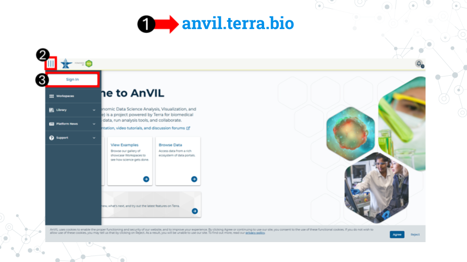
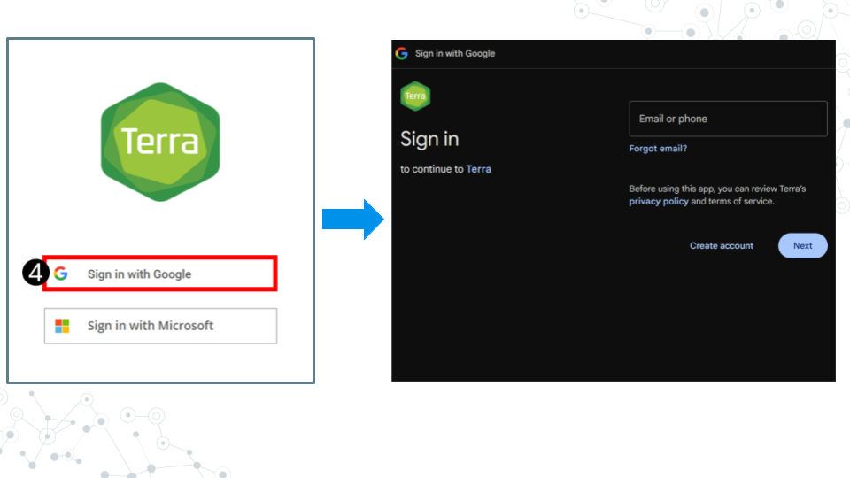

## Sign up for an AnVIL account

#### Purpose

You will need an account on AnVIL in order to use the platform. In this section we'll go over the specifics of account creation.  

#### Learning Objectives

1. Create an account on AnVIL
1. Login to AnVIL
1. Share the email you used to sign up for AnVIL with your instructor (if applicable)

### Create an AnVIL account

Follow the written steps below or refer to the [slides](https://docs.google.com/presentation/d/1uwlG7uaTOnItdpd4Ll6nNQiBJKBivsvR-erupicAwJM/edit?usp=sharing) or video guide.

1. Open [anvil.terra.bio](https://anvil.terra.bio/) in <mark> **Google Chrome** </mark>. Google Chrome is the only officially supported web browser for AnVIL. Because of this, while you can run AnVIL in other browsers you strongly suggest using Chrome.
    - Tip: bookmark this page so that you can easily access it throughout the course.
1. Click the hamburger icon (3 lines) in the top left corner of the screen 
1. Click "Sign in"

4. Click "Sign in with Google".
5. Sign in with a <mark>**Google associated email address**</mark> such as an institutional email that uses Gmail or a personal Gmail account. You must use a Google associated email address to gain access to Google Cloud computing resources. 
6. If you are a student, share the email you used to sign up for AnVIL with your instructor following their instructions.

<mark>**Instructors should collect the student emails and use them in the next section, "Setting up workspaces on AnVIL." Students do not need to set up a workspace, and should proceed to the section, "Running a module on AnVIL".**</mark> 

