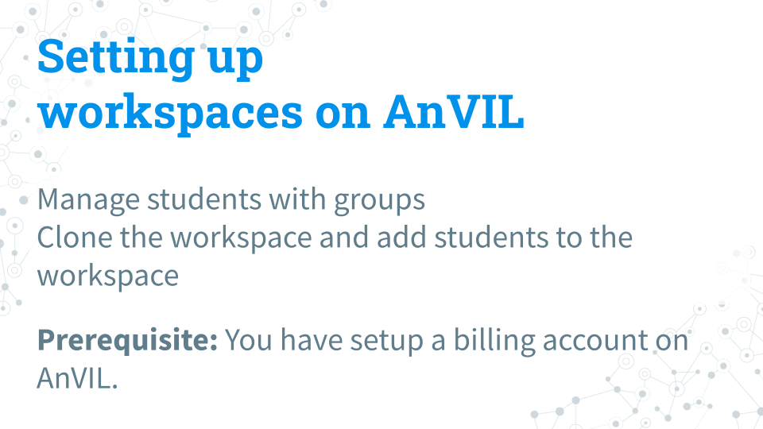
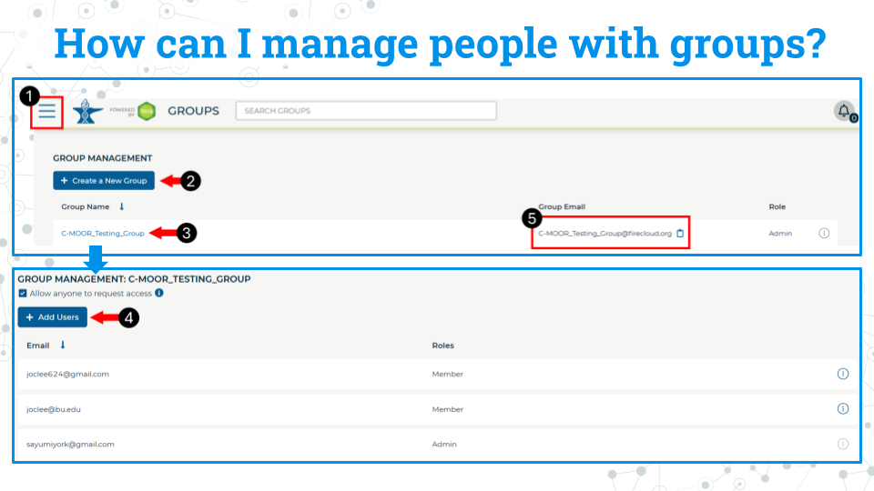
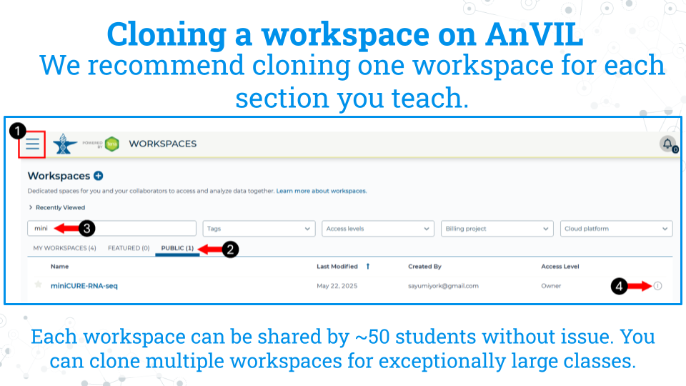
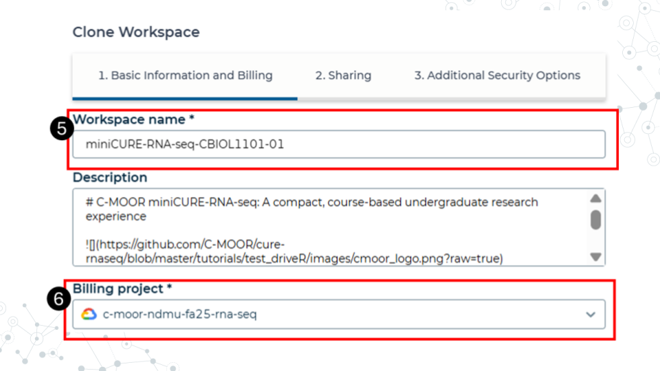
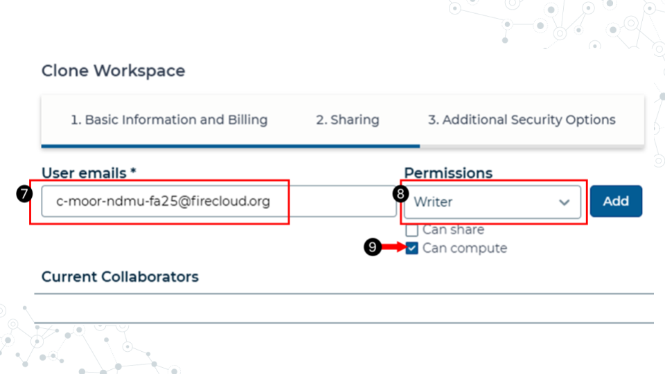

## Setting up workspaces on AnVIL

<mark>**This section is only for instructors. Students do NOT have to set up workspaces.**</mark>

Follow the written steps below or refer to the [slides](https://docs.google.com/presentation/d/1uCiZDAwgh1iM5XPlpbK5uz7oVBujmimUXVQaR8iGuho/edit?usp=sharing) or video guide.

#### Purpose

We will learn about managing students using groups and how to clone a copy of the C-MOOR workspaces for each section of a given class.

#### Learning Objectives

1. Learn how to create groups that can be used to control users' access 
1. Clone the workspace of your chosen C-MOOR curriculum for each section of your class
1. Simultaneously add students of that section to the chosen workspace

### A note to instructors on billing

Instructors should have a Google billing account associated with their AnVIL account on Terra. We will not cover how to set up a Google Billing Account, which is separate from and required by a billing project. For assistance with setting up your billing account we suggest refering to the Terra (the platform on which AnVIL runs) [guide to billing](https://support.terra.bio/hc/en-us/articles/360048632271-Terra-costs-and-billing-GCP-details) and speaking with your institution’s information technology and finance departments. 

Our team at C-MOOR is still piloting our curriculum on AnVIL. As such, we don't have much information on the approximate cost per student. We hope to provide this data in the future. 

The best way to conserve costs is to <mark>make sure that students close out their session on AnVIL properly, including the deletion of the persistent disk</mark> after they are done working. AnVIL will continue to bill the billing project even if the environment is not in active use. 

For more information on how to control computing charges, please see the Terra guide: [How to cut off GCP charges](https://support.terra.bio/hc/en-us/articles/360042023952-Runaway-costs-How-to-cut-off-GCP-charges). 

### Using groups to manage classes

We recommend you manage students and their access to workspaces through groups. When people are added to a group, they are given a new group email address that controls everyone within that group. For example, if there are 20 people in the group, all 20 are added at one time when the group email is used to give a group access to a workspace. Likewise, we recommend any management of students, such as removal or additions later in the class, be managed through the group interface.

1. Access billing by clicking on the hamburger icon in the top left corner of the window, click on your name, and select groups. This will take you to this groups page.
1. Click Create New group. You will be prompted to give your group a unique name.
1. Click on the name of the newly created group to enter it.
1. Click add users. Add users to the group using the same email they used to sign up for AnVIL.
1. You can use the group email created for the group seen on the group management page to manage everyone in that group. For example, you can add everyone in the group to a workspace by adding this group email to the billing project.

### Clone a workspace on AnVIL

The instructor will clone the workspace in AnVIL. We recommend cloning one workspace for each section you teach. Each workspace can be shared by approximately 50 students without issue. You can clone multiple workspaces for exceptionally large classes. Students in a given section will use the cloned workspace for all learning modules and the research project.

1. While logged into AnVIL, using the hamburger icon in the top left corner of the screen, navigate to the workspaces page
2. Select the public tab
3. Search for the desired workspace. Your instructor will tell you which workspace to look for (miniCURE-RNA-seq or miniCURE-16S-microbiome).
4. Click on the more options icon on the right side of the desired workspace and click clone

5. Give the cloned workspace a unique name. We recommend choosing the class and section name that the workspace is intended for.
6. Confirm the billing project is the one you want to use. In this example, we have a billing project by semester and curriculum. All computational costs by students in the workspace will be billed ot this account.

7. In the sharing step, add the students to the workspace using their group email. Refer to the section on managing students with groups for more information on adding students to groups.
8. Make the students writers.
9. Confirm that the can compute box is checked. This allows the students to computational resources on the cloud. Without it, they won’t be able to open any modules or run any code.
10. The other options can be left as defaults. Finish cloning the workspace.

**Students should now have access to the workspace. To view your workspaces, click on the hamburger icon in the top left of the screen and go to the Workspaces tab. We recommend that any further management of people and their access to the workspaces be done by managing their group.**

