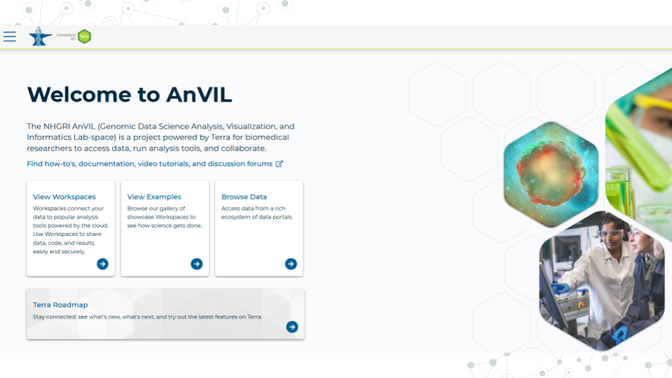
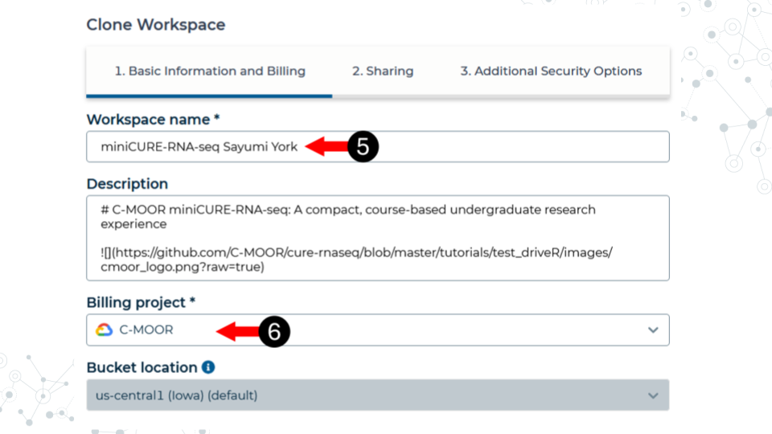
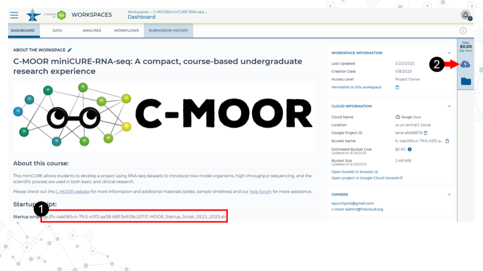
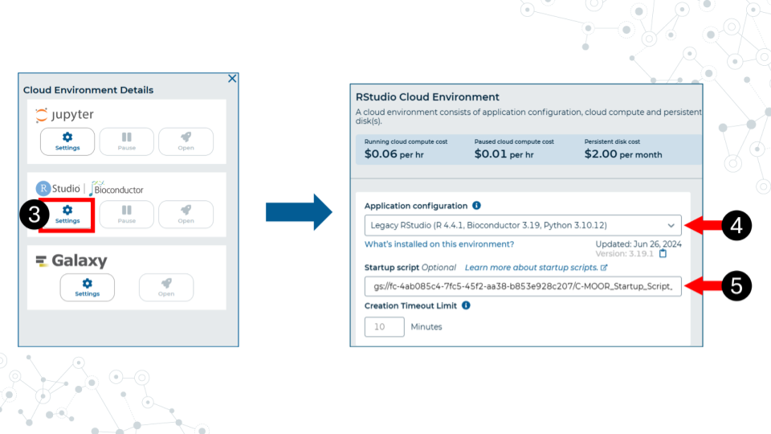
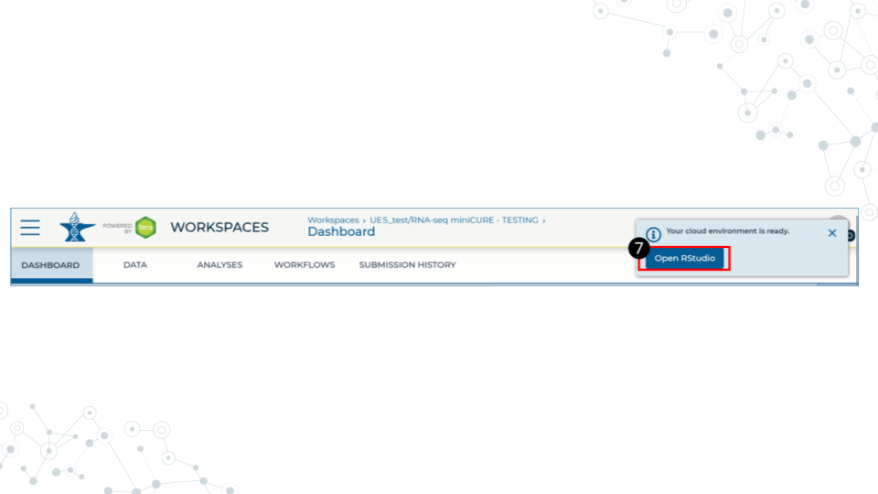
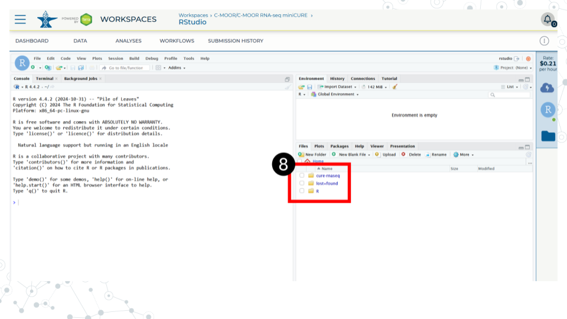
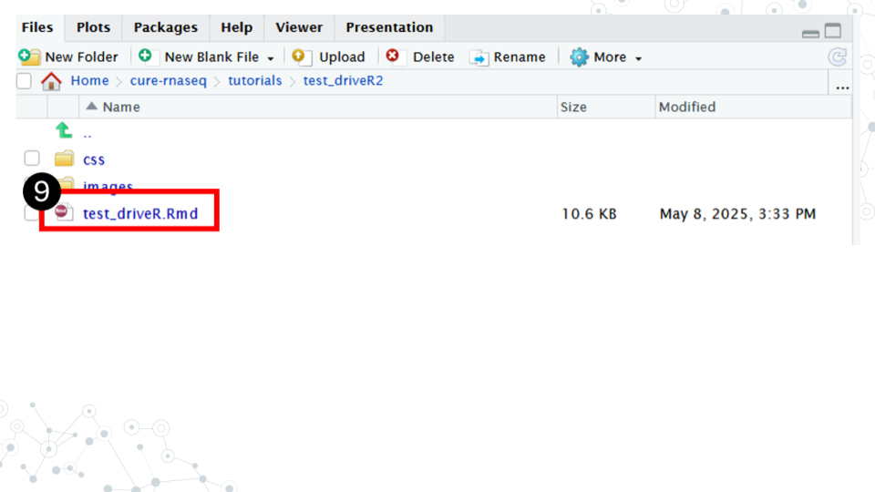
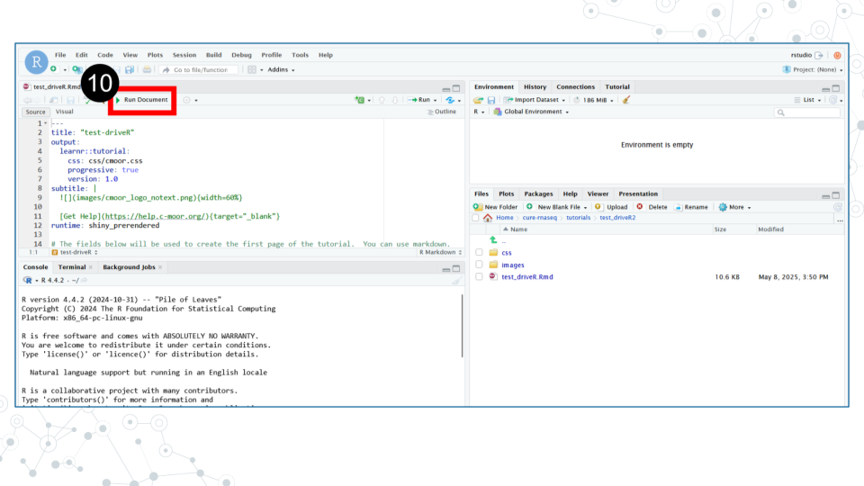
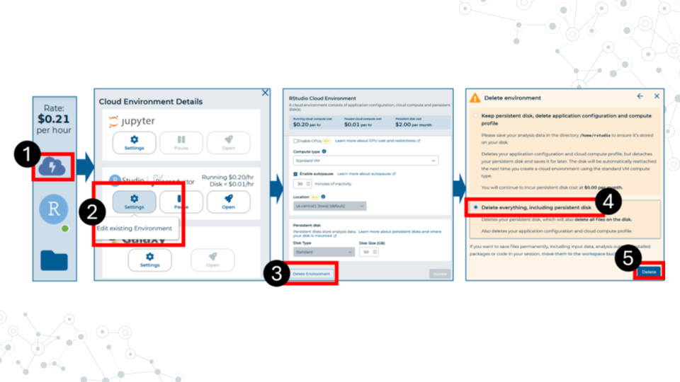

# (PART\*) INTRODUCTION TO THE WORLD OF RESEARCH {-}

# Setting up on a cloud platform

Your class will use either AnVIL or SciServer as their cloud platform for accessing tutorial modules, data, and computational resources. Refer to the appropriate section for your class. You do not have to sign up for both!

## Join AnVIL

*The Genomic Data Science Analysis, Visualization, and Informatics Lab-space*

### Purpose

Your class will use the online platform **AnVIL** to do some access learning modules and do data analysis. The purpose of this assignment is to register for an AnVIL account, and clone the workspace appropriate for your class and research project




### Learning Objectives

1. Create an account on AnVIL
1. Share your email address with your instructor
1. Clone the workspace for your specific research project

### Introduction

AnVIL (The Genomic Data Science **An**alysis, **V**isualization, and **I**nformatics **L**ab-space) is a platform created by the 
National Human Genome Research Institute (NHGRI) in collaboration with cloud computing platform providers like Google and Microsoft. Using AnVIL we you can access computing resources on the cloud through your browser without need for any fancy physical equipment. Through AnVIL you will also have access to all the software and data necessary to complete your research project. 


### Instructions

#### Create an account on AnVIL

This video ([video](https://drive.google.com/file/d/1Fk8Ha-cpAuaXccnsppGXNbRPbIdS5hFR/view?usp=sharing))([slides](---)) show you how to create an AnVIL account, clone a workspace, run a module, and then close down your environment. 

##### Sign up for an account on AnVIL

1. Open [anvil.terra.bio](https://anvil.terra.bio/) in <mark> **Google Chrome** </mark>. Google Chrome is the only officially supported web browser for AnIVL.
    a. It is a good idea to bookmark this page so that you can easily access it throughout the course.
1. Click the hamburger icon (3 horizontal lines) in the top left corner of the screen 
1. Click "Sign in"
1. Click "Sign in with Google".
1. Sign in with a <mark>**Google associated email address**</mark> such as an institutional email that uses Gmail or a personal Gmail account. You must use a Google associated email address to gain access to Google Cloud computing resources. 
1. Follow all steps required to complete creating an account (ex. email verification of account)
1. Share the email you used to sign up for AnVIL with your instructor.

**Your instructor will add you to a billing project that will allow you to use computational resources on AnVIL. Until they do so, you will not be able to compute anything.** 

##### Clone a workspace on AnVIL

1. While logged into AnVIL, using the hamburger icon in the top left corner of the screen, navigate to the workspaces page
1. Select the public tab
1. Search for the desired workspace. Your instructor will tell you which workspace to look for (miniCURE-RNA-seq or miniCURE-16S-Human_Gut).
1. Click on the more options icon on the right side of the desired workspace and click clone
1. Give the cloned workspace a unique name, such as by adding your initials or last name. All workspaces must have unique names; if someone has already taken the workspace name you initially wanted, please try a different name.
1. Confirm the billing project is the one your instructor has chosen.
1. The rest of the options should be left as is. Clone the workspace. It may take a few minutes to clone.

<mark>**You only have to clone the workspace once. From now on, use your cloned workspace.**</mark> After you clone the workspace you will automatically be directed to it. For all other times, your workspaces can be found using the hamburger icon in the top left.




##### Running modules on AnVIL

When you open the workspace, you will be on the dashboard tab by default. The dashboard contains the instructions on how to use the workspace, links to C-MOOR websites, and the startup script.

1. <mark>**Copy the startup script**</mark>. Make sure there are no spaces before or after what you copy. This script is held in the original workspace everyone cloned. It does not have to be in your own workspace for it to work.
2. Click on the Environment Configuration button (cloud with thunderbolt)



3. In the RStudio section, click Settings
4. In application configuration, select Legacy RStudio (R 4.4.1, Bioconductor 3.19, Python 3.10.12). 
5. In the <mark>**startup script field, paste the startup script**</mark>
6. Scroll to the bottom of the window and click “Create”. 



It will take some time for the RStudio Environment to be created. You can keep track of the status of the environment based on the colored dot next to the RStudio icon. The dot will turn green when the environment is ready. While it is loading (blue), you cannot interact with it.


7. When the environment is ready, use the Open RStudio button that will pop up. You can also access RStudio through the Analyses tab. If you hold down Ctrl as you click, you can open RStudio in a new window.



8. Use the file explorer in RStudio to navigate to your module of choice. From the folder called cure-rnaseq, go to tutorials, and then the folder of the module you want.



9. In the module’s directory, open the .Rmd file by double clicking its name.



10. Click Run Document in the open .Rmd file




```
## ─ Session info ───────────────────────────────────────────────────────────────
##  setting  value
##  version  R version 4.3.2 (2023-10-31)
##  os       Ubuntu 22.04.4 LTS
##  system   x86_64, linux-gnu
##  ui       X11
##  language (EN)
##  collate  en_US.UTF-8
##  ctype    en_US.UTF-8
##  tz       Etc/UTC
##  date     2025-07-17
##  pandoc   3.1.1 @ /usr/local/bin/ (via rmarkdown)
## 
## ─ Packages ───────────────────────────────────────────────────────────────────
##  package     * version date (UTC) lib source
##  askpass       1.2.0   2023-09-03 [1] RSPM (R 4.3.0)
##  bookdown      0.41    2024-10-16 [1] CRAN (R 4.3.2)
##  bslib         0.6.1   2023-11-28 [1] RSPM (R 4.3.0)
##  cachem        1.0.8   2023-05-01 [1] RSPM (R 4.3.0)
##  chromote      0.3.1   2024-08-30 [1] CRAN (R 4.3.2)
##  cli           3.6.2   2023-12-11 [1] RSPM (R 4.3.0)
##  curl          5.2.0   2023-12-08 [1] RSPM (R 4.3.0)
##  devtools      2.4.5   2022-10-11 [1] RSPM (R 4.3.0)
##  digest        0.6.34  2024-01-11 [1] RSPM (R 4.3.0)
##  dplyr         1.1.4   2023-11-17 [1] RSPM (R 4.3.0)
##  ellipsis      0.3.2   2021-04-29 [1] RSPM (R 4.3.0)
##  evaluate      0.23    2023-11-01 [1] RSPM (R 4.3.0)
##  fansi         1.0.6   2023-12-08 [1] RSPM (R 4.3.0)
##  fastmap       1.1.1   2023-02-24 [1] RSPM (R 4.3.0)
##  fs            1.6.3   2023-07-20 [1] RSPM (R 4.3.0)
##  generics      0.1.3   2022-07-05 [1] RSPM (R 4.3.0)
##  glue          1.7.0   2024-01-09 [1] RSPM (R 4.3.0)
##  highr         0.11    2024-05-26 [1] CRAN (R 4.3.2)
##  hms           1.1.3   2023-03-21 [1] RSPM (R 4.3.0)
##  htmltools     0.5.7   2023-11-03 [1] RSPM (R 4.3.0)
##  htmlwidgets   1.6.4   2023-12-06 [1] RSPM (R 4.3.0)
##  httpuv        1.6.14  2024-01-26 [1] RSPM (R 4.3.0)
##  httr          1.4.7   2023-08-15 [1] RSPM (R 4.3.0)
##  janitor       2.2.0   2023-02-02 [1] RSPM (R 4.3.0)
##  jquerylib     0.1.4   2021-04-26 [1] RSPM (R 4.3.0)
##  jsonlite      1.8.8   2023-12-04 [1] RSPM (R 4.3.0)
##  knitr         1.48    2024-07-07 [1] CRAN (R 4.3.2)
##  later         1.3.2   2023-12-06 [1] RSPM (R 4.3.0)
##  lifecycle     1.0.4   2023-11-07 [1] RSPM (R 4.3.0)
##  lubridate     1.9.3   2023-09-27 [1] RSPM (R 4.3.0)
##  magrittr      2.0.3   2022-03-30 [1] RSPM (R 4.3.0)
##  memoise       2.0.1   2021-11-26 [1] RSPM (R 4.3.0)
##  mime          0.12    2021-09-28 [1] RSPM (R 4.3.0)
##  miniUI        0.1.1.1 2018-05-18 [1] RSPM (R 4.3.0)
##  openssl       2.1.1   2023-09-25 [1] RSPM (R 4.3.0)
##  ottrpal       1.3.0   2024-10-23 [1] Github (jhudsl/ottrpal@2e19782)
##  pillar        1.9.0   2023-03-22 [1] RSPM (R 4.3.0)
##  pkgbuild      1.4.3   2023-12-10 [1] RSPM (R 4.3.0)
##  pkgconfig     2.0.3   2019-09-22 [1] RSPM (R 4.3.0)
##  pkgload       1.3.4   2024-01-16 [1] RSPM (R 4.3.0)
##  processx      3.8.3   2023-12-10 [1] RSPM (R 4.3.0)
##  profvis       0.3.8   2023-05-02 [1] RSPM (R 4.3.0)
##  promises      1.2.1   2023-08-10 [1] RSPM (R 4.3.0)
##  ps            1.7.6   2024-01-18 [1] RSPM (R 4.3.0)
##  purrr         1.0.2   2023-08-10 [1] RSPM (R 4.3.0)
##  R6            2.5.1   2021-08-19 [1] RSPM (R 4.3.0)
##  Rcpp          1.0.12  2024-01-09 [1] RSPM (R 4.3.0)
##  readr         2.1.5   2024-01-10 [1] RSPM (R 4.3.0)
##  remotes       2.4.2.1 2023-07-18 [1] RSPM (R 4.3.0)
##  rlang         1.1.4   2024-06-04 [1] CRAN (R 4.3.2)
##  rmarkdown     2.25    2023-09-18 [1] RSPM (R 4.3.0)
##  rprojroot     2.0.4   2023-11-05 [1] CRAN (R 4.3.2)
##  sass          0.4.8   2023-12-06 [1] RSPM (R 4.3.0)
##  sessioninfo   1.2.2   2021-12-06 [1] RSPM (R 4.3.0)
##  shiny         1.8.0   2023-11-17 [1] RSPM (R 4.3.0)
##  snakecase     0.11.1  2023-08-27 [1] RSPM (R 4.3.0)
##  stringi       1.8.3   2023-12-11 [1] RSPM (R 4.3.0)
##  stringr       1.5.1   2023-11-14 [1] RSPM (R 4.3.0)
##  tibble        3.2.1   2023-03-20 [1] CRAN (R 4.3.2)
##  tidyselect    1.2.0   2022-10-10 [1] RSPM (R 4.3.0)
##  timechange    0.3.0   2024-01-18 [1] RSPM (R 4.3.0)
##  tzdb          0.4.0   2023-05-12 [1] RSPM (R 4.3.0)
##  urlchecker    1.0.1   2021-11-30 [1] RSPM (R 4.3.0)
##  usethis       2.2.3   2024-02-19 [1] RSPM (R 4.3.0)
##  utf8          1.2.4   2023-10-22 [1] RSPM (R 4.3.0)
##  vctrs         0.6.5   2023-12-01 [1] RSPM (R 4.3.0)
##  webshot2      0.1.1   2023-08-11 [1] CRAN (R 4.3.2)
##  websocket     1.4.2   2024-07-22 [1] CRAN (R 4.3.2)
##  xfun          0.48    2024-10-03 [1] CRAN (R 4.3.2)
##  xml2          1.3.6   2023-12-04 [1] RSPM (R 4.3.0)
##  xtable        1.8-4   2019-04-21 [1] RSPM (R 4.3.0)
##  yaml          2.3.8   2023-12-11 [1] RSPM (R 4.3.0)
## 
##  [1] /usr/local/lib/R/site-library
##  [2] /usr/local/lib/R/library
## 
## ──────────────────────────────────────────────────────────────────────────────
```

##### Closing out a session on AnVIL

1. On the right side of the screen, click the Cloud Environment button. This is the Cloud with the lighting symbol.
1. Under the RStudio section, click settings.
1. Scroll to the bottom of the new window and click delete environment.
1. Check <mark>**Delete everything, including the persistent disk or your instructor's billing account will incur costs for storage**</mark>. 



### Footnotes

#### Contributions and Affiliations

- Sayumi York, Notre Dame University of Maryland

Last Revised: July 16, 2025
