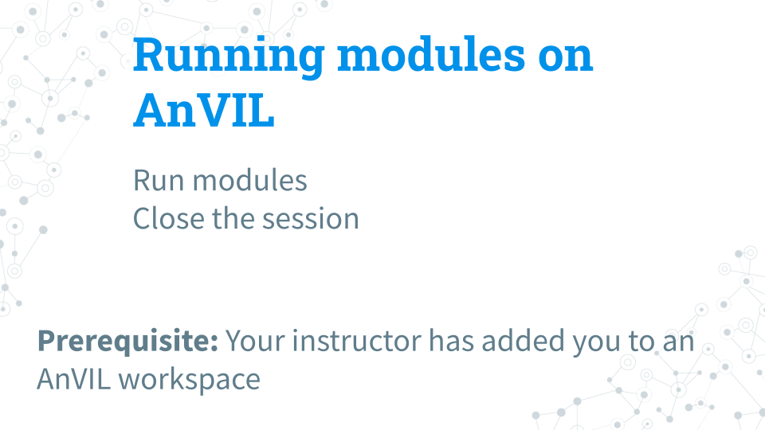
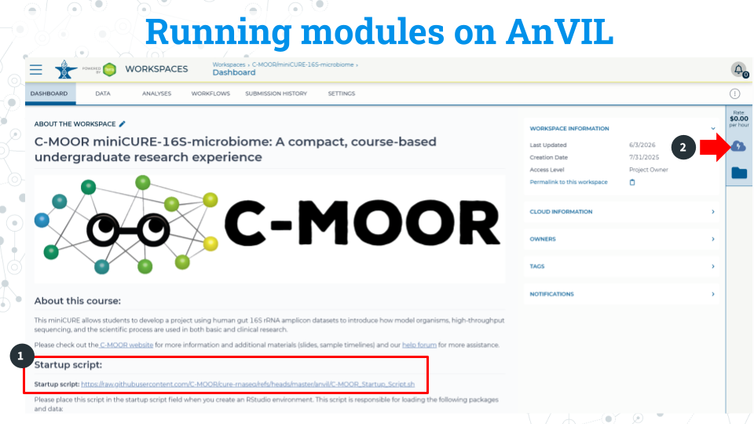
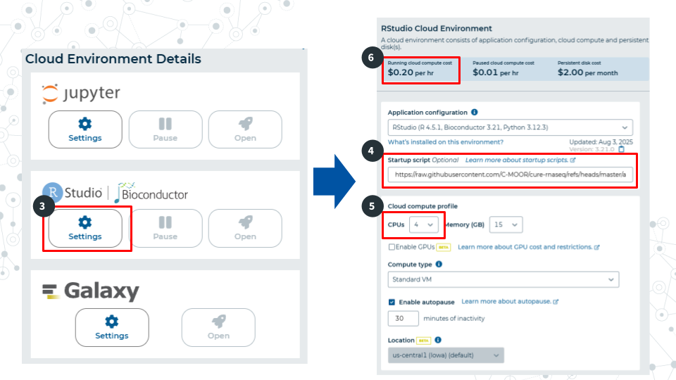
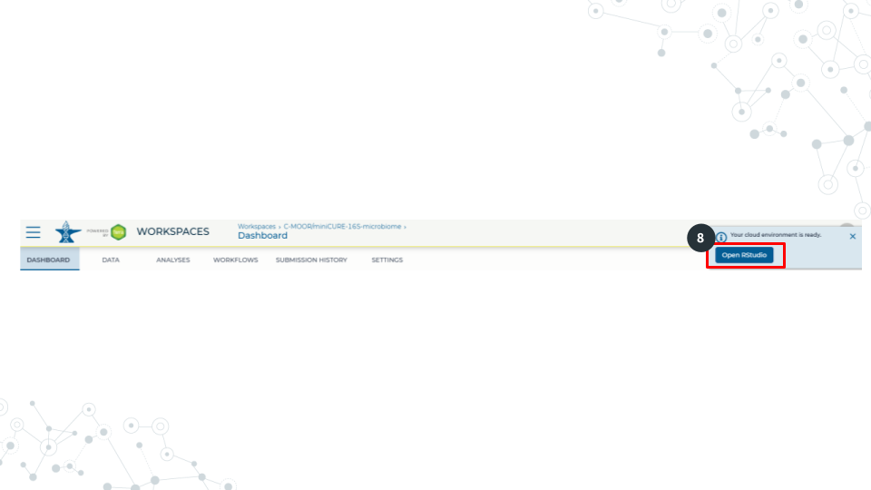
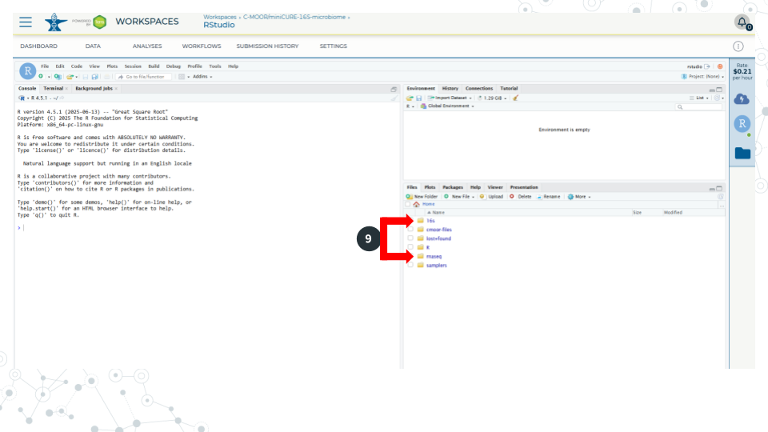
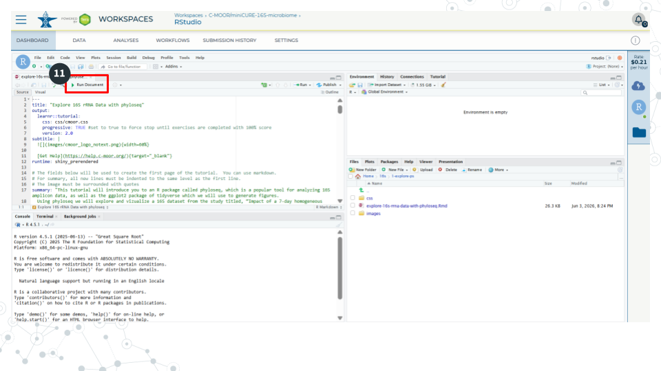
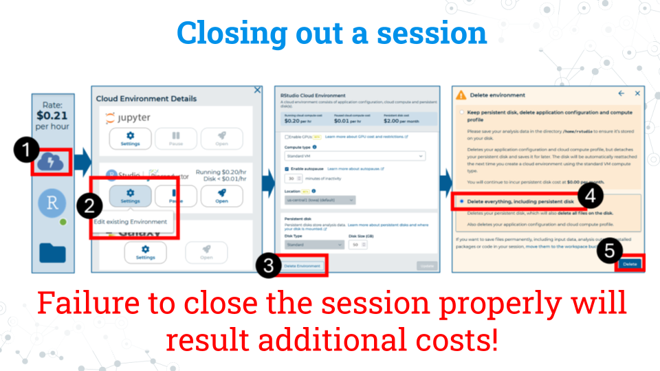

<!-- Set up code of OTTR Book-->

## AnVIL Onboarding

### Join AnVIL

#### Purpose

You will need an account on AnVIL in order to use the platform. In this section we'll go over the specifics of account creation.  

#### Learning Objectives

1. Create an account on AnVIL
1. Login to AnVIL
1. Share the email you used to sign up for AnVIL with your instructor (if applicable)

#### Introduction

AnVIL (The Genomic Data Science **An**alysis, **V**isualization, and **I**nformatics **L**ab-space) is a platform created by the National Human Genome Research Institute (NHGRI) in collaboration with cloud computing platform providers like Google and Microsoft. Using AnVIL we can access computing resources on the cloud through your browser without need for any fancy physical equipment. Through AnVIL you will also have access to all the software and data necessary to complete your research project. 

In this section, we will set up our accounts on AnVIL and go through the entire lifecycle of an RStudio environment from creation to deletion. You will repeat this process throughout the semester; feel free to refer back to this section if you need a refresher on how to use AnVIL.

#### Part 1 -- Create an account on AnVIL

Follow the written steps below or refer to the [slides](https://docs.google.com/presentation/d/1uwlG7uaTOnItdpd4Ll6nNQiBJKBivsvR-erupicAwJM/edit?usp=sharing) or video guide.

1. Open [anvil.terra.bio](https://anvil.terra.bio/) in <mark> **Google Chrome** </mark>. Google Chrome is the only officially supported web browser for AnVIL. Because of this, while you can run AnVIL in other browsers you strongly suggest using Chrome.
    - Tip: bookmark this page so that you can easily access it throughout the course.
1. Click the hamburger icon (3 lines) in the top left corner of the screen 
1. Click "Sign in"

4. Click "Sign in with Google".
5. Sign in with a <mark>**Google associated email address**</mark> such as an institutional email that uses Gmail or a personal Gmail account. You must use a Google associated email address to gain access to Google Cloud computing resources. 
6. If you are a student, share the email you used to sign up for AnVIL with your instructor following their instructions.

<mark>**Instructors should collect the student emails and use them in the next section, "Setting up workspaces on AnVIL." Students do not need to set up a workspace, and should proceed to the section, "Running a module on AnVIL".**</mark> 

##### Resources

- [AnVIL](https://anvil.terra.bio/) 
- [How to add a bookmark in Chrome](https://support.google.com/chrome/answer/188842)
- [AnVIL support home](https://support.terra.bio/hc/en-us)

### Running a module on AnVIL
<!-- change fig.align quotes from single to double -->

#### Purpose

In this section we will go over how to run C-MOOR modules on AnVIL. We will go over how to create an RStudio environment in that workspace to run the module and properly end a session on AnVIL to prevent runaway costs.

#### Learning Objectives

1. Launch a module through the cloned workspace
1. Close out a session on AnVIL properly to prevent runaway costs

#### Introduction

Before beginning this assignment, you should have already created an AnVIL account and submitted the email you used to sign up for AnVIL to your instructor. In this assignment you will learn how to setup an RStudio environment on AnVIL. This environment is analogous to preparing a lab space for a physical lab. You have to have the right equipment and reagents to be able to do the activity. 

This assignment shows you how to set up the RStudio environment and start up your first C-MOOR tutorial.

#### Part 1 -- Confirm you have access to your class workspace

The workspace is the heart of AnVIL. To be able to run modules, you need to have access to the class workspace. Here are some key points about workspaces:

- Every workspace comes with its own Google Bucket (our cloud storage). Your bucket will be empty.
- Every workspace has its own billing project. Students who are not yet associated with a billing project will not be able to compute on their workspace.
- We can control access levels of users and set them either as owners, writers, or readers. Students will be writers with compute access.

The workspace is the heart of AnVIL. 

1. Open [AnVIL](https://anvil.terra.bio/) in Google Chrome
1. Click on the hamburger icon in the top left corner
1. Login to your AnVIL account
1. Click on the hamburger icon in the top left corner again
1. Click workspaces
1. Confirm you see your class workspace
1. Click on the workspace name to enter the workspace.

##### Resources

- [AnVIL](https://anvil.terra.bio/) 
- [Get help with AnVIL on the C-MOOR Discourse](https://help.c-moor.org/c/help/)

#### Part 2 -- Start access a module

When you open the workspace, you will be on the dashboard tab by default. The dashboard contains the instructions on how to use the workspace, links to C-MOOR websites, and the startup script. Let’s try running a module.

1.  Copy the URL of the startup script. Make sure there are no spaces before or after what you copy. This script is held in the original workspace everyone cloned. You will need to input this URL soon.

2. Click on the Environment Configuration button, the cloud with a thunderbolt.

3. In the RStudio section, click Settings

4. In the startup script field, paste the URL for the startup script. 

5. Select 4 CPUs and 15 gigabytes of memory.

6. Confirm that the cloud compute cost is 20 cents per hour. If it is not 20 cents per hour, reselect CPUs and memory allocation in step 5 This is a known bug in AnVIL at the writing of this guide.

7. Scroll to the bottom of the window and click “Create”. It will take about 2 minutes for the environment to be created.

It will take some time for the RStudio Environment to be created. You can keep track of the status of the environment based on the colored dot next to the RStudio icon. The dot will turn green when the environment is ready. While it is loading (blue), you cannot interact with it.

8. When the environment is ready, use the Open RStudio button that will pop up. If you hold down Ctrl as you click, you can open RStudio in a new window.

9. Use the file explorer in RStudio to navigate to your module of choice. First, enter the folder of the curriculum you are using, either rnaseq (not cure-rnaseq) or 16s. Then enter the folder of the module you want to run. 

10. In the module’s directory, open the .Rmd file by double clicking its name.

11. Click Run Document in the open .Rmd file

<mark>**When you are finished, make sure you close out your session properly to prevent runaway costs!**</mark>. 

##### Resources

- [AnVIL](https://anvil.terra.bio/) 
- [Get help with AnVIL on the C-MOOR Discourse](https://help.c-moor.org/c/help/)

#### Part 3 -- Closing out a session on AnVIL

1. On the right side of the screen, click the Cloud Environment button. This is the Cloud with the lightning symbol.
1. Under the RStudio section, click settings.
1. Scroll to the bottom of the new window and click delete environment.
1. Check <mark>**Delete everything, including the persistent disk or your instructor's billing account will incur costs for storage**</mark>. 

##### Resources

- [AnVIL](https://anvil.terra.bio/) 
- [Get help with AnVIL on the C-MOOR Discourse](https://help.c-moor.org/c/help/)

#### Footnotes

##### Contributions and Affiliations

- Sayumi York, Notre Dame of Maryland University

Last Revised: June 5, 2026

