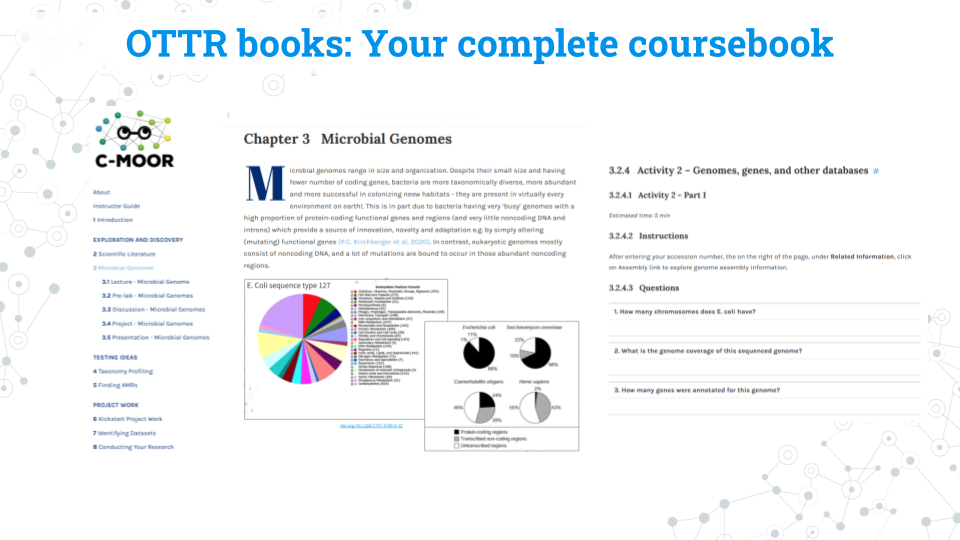
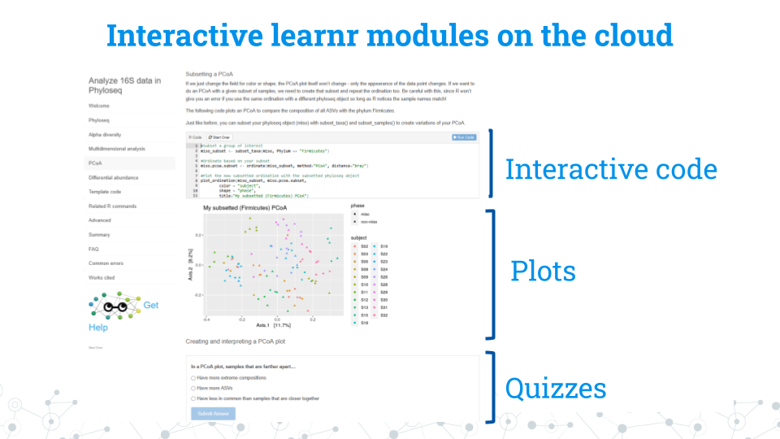
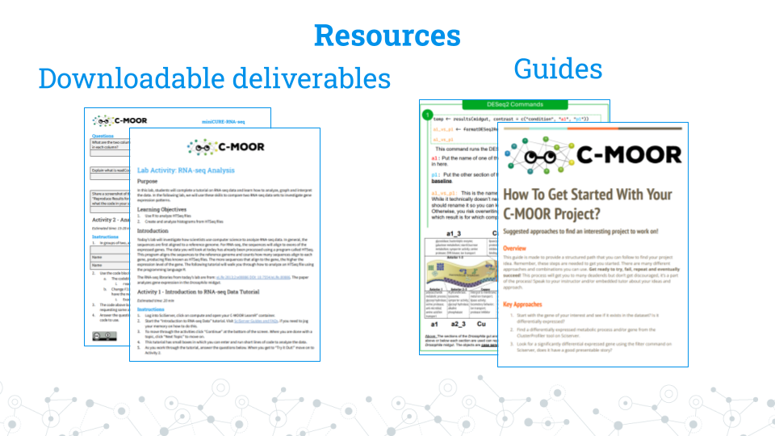

# How to use a C-MOOR curriculum

There are 3 major components of a C-MOOR curriculum:

1. The OTTR book (what you're reading right now)
1. The interactive learn modules that are run a cloud platform
1. The assignments that link the book to the modules

In this section, we'll quickly cover what each component does, where it's found, and how to use that resource.

### OTTR books

The OTTR book is essentially a coursebook for that particular curriculum. We have OTTR books for each major curricula and a separate book for our model organisms and biological databases unit. This is where you will find the following:

- **Lectures:** In their own sections titled 'Lab Slides' or 'Lecture'
- **Assignments and Activities:** In the sections titled 'Pre-labs', 'Activities', 'Discussions', and 'Presentations'. You can find the instructions, goals, and estimated time needed for each respective section. The main body of each will also contain the text (instructions, purpose, questions) for the Google Doc or other resources found at the bottom of the page. We create these Google Drive resources for you to copy, download, and edit as your class sees fit to do so. Our instructors have students download these resources locally, fill them out on their own computer or Google Drive and submit them through your school's learning management system.
- **Related resources**: At the bottom of every page, we have a list of links to resources relating to that specific section. For example, we would link our blank assignments for all our assignments here. We also provide guides for students (currently only available for our RNA-seq offerings). We are working to make all of these resources also available in the appendix of each OTTR book. 

### Interactive learnr modules on the cloud

Our learnr modules contain self-paced lessons and all the resources students will need to complete their research projects. Through these modules students will generate plots using interactive code chunks and take non-graded try-as-many-times-as-you-want quizzes to better refine their understanding of how to work with their data and the underlying biological and statistical concepts.

Please see the sections on setting up on a cloud platform for more details on how to run these modules.

### Related resources

As mentioned above, at the bottom of each section of an OTTR book you can find links to resources such as assignments in Google Doc form. We've formatted these files to be easy for instructors and students to download, modify, and submit at their convenience. We also have guides for students to use as they work on their research projects; we are working to expand the number of guides for students to use across different curricula. 

### Example lesson how-to

Here's an example of how to run a C-MOOR module using the [Differential Expression chapter of the RNA-seq miniCURE](https://science.c-moor.org/miniCURE-RNA-seq/differential-gene-expression.html). This chapter is chapter 5 of the OTTR book.

1. Using the lab slides in [section 5.1 of the OTTR book](https://science.c-moor.org/miniCURE-RNA-seq/lab-slides-differential-gene-expression.html), the instructor guides students through what to expect in the lesson and what is in the dataset.
1. Students launch the learnr module on the class's chosen cloud platform. 
1. Refer to [section 5.2 of the OTTR book](https://science.c-moor.org/miniCURE-RNA-seq/lab-activity-differential-gene-expression.html), which directly follows the slides. Scroll to the bottom of the page and open the Google Doc in the resources section. 
1. Students download the assignment to their local computer and/or copy it to their Google Drive. 
1. Students complete the assignment following the instructions and use the learnr module to answer questions.
1. Students turn in the assignment on their LMS or through their instructor's chosen method.
1. Students close their session on the cloud

Note that the majority of the text in section 5.2 of the OTTR book is identical to the downloadable assignment.
