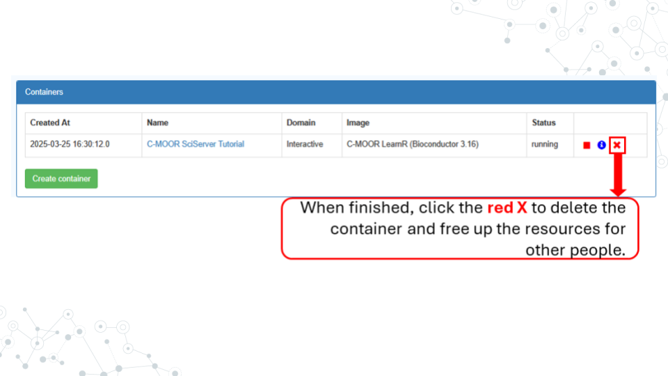
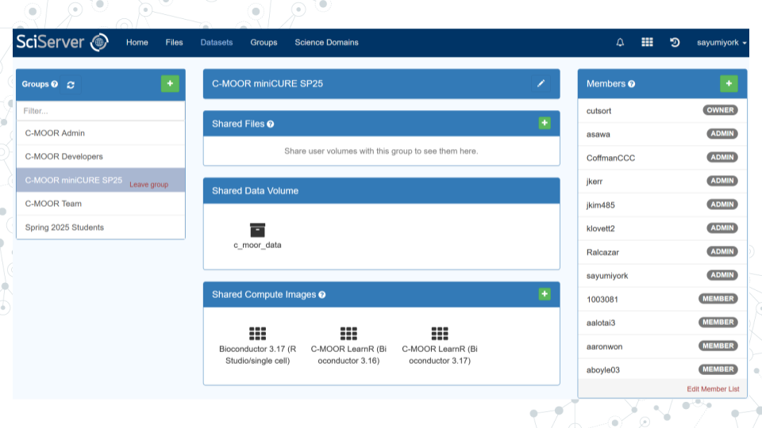
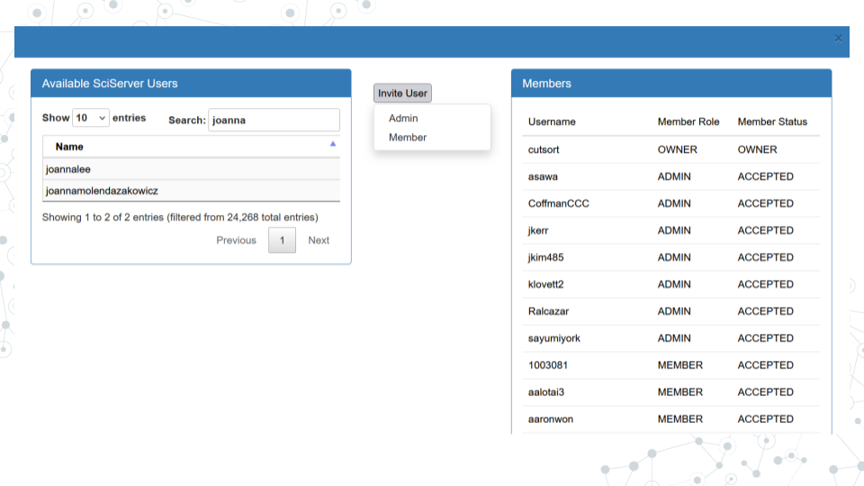

<!-- Set up code of OTTR Book-->

# SciServer Instructor Prep

#### Introduction

You have the choice of a number of online computing platforms for running your C-MOOR classes. One of these is [**Sciserver**](https://www.sciserver.org/). In this section, we'll show you what you need to setup on SciServer as an instructor and how to invite students to gain access to all the resources they'll need for modules and their research projects. 

## Setup your SciServer account

#### Purpose

Create an account on SciServer. **The steps in this section only need to be completed once.**

#### Learning Objectives

1. Create an account on SciServer
1. Confirm your email address
1. Confirm your access to class materials on SciServer

This video ([video](https://link.c-moor.org/video-join-sciserver))([slides](https://docs.google.com/presentation/d/1kxbnBLoRsdPW4ZkjwNsAHS1XFPuJpQZ8I1aVqyZISW0)) shows you how to create a SciServer account. You can follow along with the video, or follow the steps below.

1. Open [sciserver.org](https://www.sciserver.org/) in a web browser
    a. It is a good idea to bookmark this page so that you can easily access it throughout the course.
1. Click “Login to SciServer”
1. Click “Create a new account”
1. Enter a User name, Email, etc. and click “Create account”
    a. Note that you cannot change your username once you have made your account

#### Confirm your email address

1. **Important!**: Click the verification link in your email inbox.
    a. If you do not verify your account you will get locked out and will need to contact your instructor to unlock your account.
    a. If you do not see an email, try checking your spam folder.
1. After clicking the verification link, confirm that your username appears in the upper right hand corner.

#### Share your username with someone from C-MOOR

You can contact our team through the contact form on [our website](c-moor.org) or by making a post on the [C-MOOR Academy Help Discussion Forum](https://help.c-moor.org/). They will add you to one of our groups on SciServer, giving you access to C-MOOR modules and data.

1. Share your username with someone from C-MOOR and await invitation to the SciServer group

#### Accept invitation from C-MOOR to join a group

This video ([video](https://link.c-moor.org/video-join-sciserver-group))([slides](https://docs.google.com/presentation/d/1codot9UeUO7l0EDcEre7dJgyXurD_xyxpw6IJL_aEjM)) shows you how to join a SciServer group.  You can follow along with the video, or follow the steps below.

1. Open [sciserver.org](https://www.sciserver.org/) in a web browser and log in to your account.
1. Click “Groups”
1. On the left, you should see a list of all the groups you have joined or been invited to.  Click on the name of the group for this course, then click “Accept invitation”.
1. Confirm that you can access course data
    a. On the top menu bar, click “Files”
    a. On the left-hand menu, click “Data Volumes”
    a. Confirm that you see “C-MOOR-Data”
1. Confirm that you can access course computing resources
    a. Click “Home” in the top menu to return to the home page.
    a. Scroll down to the second set of boxes and click “Compute”
    a. Click “Create container”
    a. In the “Compute Image” drop-down menu, confirm that you can see “C-MOOR LearnR” and “C-MOOR R-Studio”
    a. Under “Data Volumes”, confirm that you can see “C-MOOR Data”
    a. You can close the Create Container dialog box (by clicking the “X” in the top right) once you’ve confirmed that you can see the C-MOOR content

#### Troubleshooting

- Some students have had issues signing up or logging into SciServer but were successful at a later date/time. We suggest giving students time to sign up well in advance of their first module on SciServer in case of technical difficulties.

## Running modules on SciServer

#### Purpose

The purpose of this assignment is to learn how to access the modules for your course on SciServer and properly close out your session when finished.

#### Learning Objectives

1. Start up a C-MOOR LearnR compute container
1. Access a C-MOOR module
1. Delete your C-MOOR LearnR compute container when finished

Before beginning this assignment, you should have already created a SciServer account and submitted your SciServer username to your instructor.  In this assignment you will learn how to set up a “compute container” on SciServer.  Compute containers are how you use programs on SciServer.  There are two C-MOOR compute containers on SciServer: “C-MOOR LearnR” has tutorials that will teach you how to run data analyses, and “C-MOOR R-Studio” is where you can work on your own data analysis projects.  This assignment shows you how to set up the C-MOOR LearnR compute container and start up your first tutorial.

### Start up a “C-MOOR LearnR” compute container

This video ([video](https://link.c-moor.org/video-sciserver-create-learnr-container))([slides](https://docs.google.com/presentation/d/1Oaq8RzhaDANxkNh-tTKwme7e095pGgoiq5iZHbt7PLg)) shows you how to create and start up a C-MOOR LearnR compute container.  You can follow along with the video, or follow the steps below.

1. Open [sciserver.org](https://www.sciserver.org/) in a web browser and log in to your account.
    a. If you are already logged in, click “Home” in the top menu to return to the home page.
1. Scroll down to the second set of boxes and click “Compute”
1. Click “Create container”
    a. Give your container a name.  This can be anything you like, but it’s useful if it says something about the purpose of the container so you can tell your containers apart.  You could name this container “Tutorials”, since you’ll be using it to access tutorials.
    a. In the “**Compute Image**” drop-down menu, select the “**C-MOOR LearnR that your instructor chooses**”
    a. Under “**Data Volumes**”, check the box next to “**C-MOOR Data**”
    a. Click “Create”.  This may take a moment.
1. You should now see a new entry in your list of containers
    a. “Created At” should be a few moments ago.
    a. “Name” should be the name you chose
    a. “Image” should be “C-MOOR LearnR”
1. Start your C-MOOR LearnR container by clicking on its name (whatever name you chose when you created it).  This will open in a new tab.
    a. You should see a list of tutorials, organized by topic.
    

a. If instead you see an error message, you most likely forgot to check the box next to “C-MOOR Data” when you created the container.
  

a. If you see something else, you may have picked the wrong “Compute Image” from the drop-down menu.

**If anything goes wrong, you can always delete your container by clicking the red “X” in the last column, and create a new container.**

### Opening C-MOOR modules

1. If you’re not there already, go to the SciServer compute page and start up the C-MOOR LearnR container.
    a. Open [sciserver.org](https://www.sciserver.org/) in a web browser and log in to your account.
    a. If you are already logged in, click “Home” in the top menu to return to the home page.
    a. Scroll down to the second set of boxes and click “Compute”.
    a. Start your C-MOOR LearnR container by clicking on its name.
1. Click on the module chosen by your instructor.  The tutorial will open in a new tab.
1. Complete the tutorial.

### Delete your C-MOOR LearnR compute container

Compute containers are meant to be temporary, and you can only have 3 containers total on SciServer.  So it’s generally a good idea to clean up after yourself and delete your containers when you’re done using them.  Also, if any updates are made to the C-MOOR LearnR container, **you will need to create a new container to get the latest updates.**

**Deleting your container will delete your progress in a tutorial**, so don’t delete the container until you have completed the tutorial and submitted any required items to your instructor.

To delete a container:

1. If you’re not there already, go to the SciServer compute page.
    a. Open [sciserver.org](https://www.sciserver.org/) in a web browser and log in to your account.
    a. If you are already logged in, click “Home” in the top menu to return to the home page.
    a. Scroll down to the second set of boxes and click “Compute”.
1. Find the container you want to delete.
1. Click on the red “X” in the last column.

## Inviting students to a SciServer group

Once you've confirmed everything works on your account, it's time to start inviting students to your group. To do so you must have their SciServer usernames. We suggest using a Google form to collect these names and setting everyone up well in advance of their first modules in case of unforeseen technical issues:

1. Navigate to the groups page on SciServer, accessible through the tabs on the top of the screen.
1. In the section titled "Members", click the green plus button.
1. Search the students' usernames in the search box under "Available SciServer Users".
1. Click "Invite User".
1. Select "Member". The invitation will be sent although there is no feedback from SciServer. To confirm that someone has been invited you can scroll though the list of names under "Members". Students that have joined the group are listed as ACCEPTED. Students that have yet to join are listed as INVITED.

#### Footnotes

#### Resources

- [sciserver.org](https://www.sciserver.org/)
- [Get help with SciServer on the C-MOOR Discourse](https://help.c-moor.org/c/help/)

#### Contributions and Affiliations

- Katherine Cox, Johns Hopkins University
- Frederick Tan, Carnegie Institution
- Sayumi York, Notre Dame of Maryland University

Last Revised: July 18, 2025

