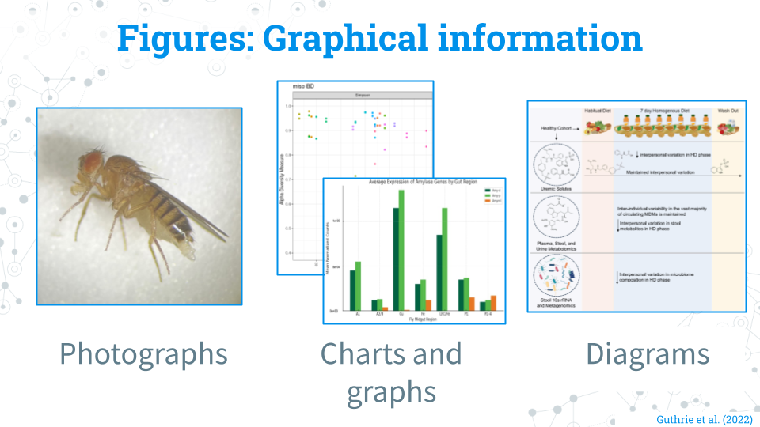
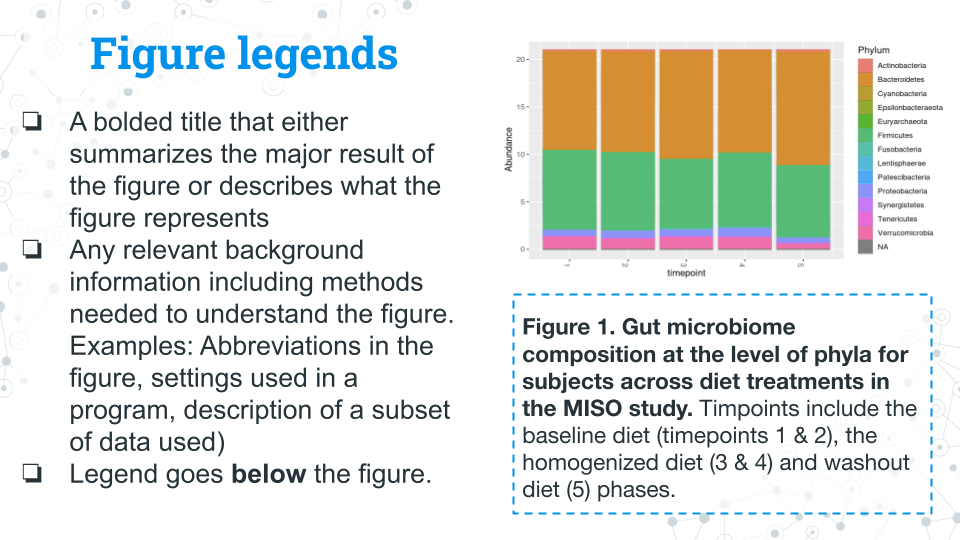
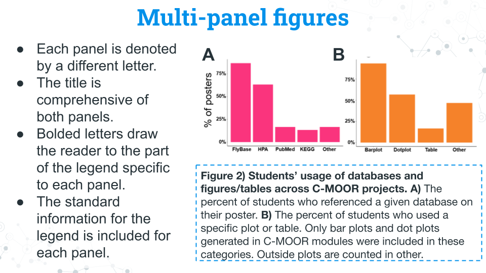
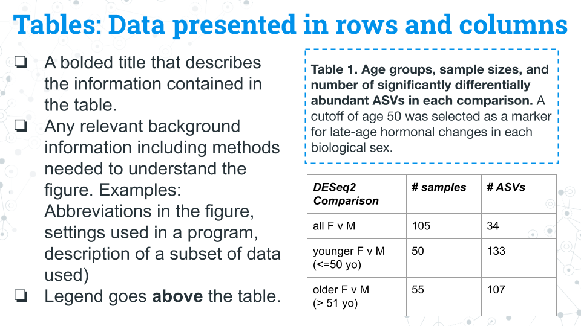

# Figure and tables guide

Figures and tables are found in all forms of scientific communication: posters, papers, and presentations. The information on this page is specific to posters and papers, although a good presentation will build off the materials here. 

### Figures

**What counts as a figure:** Pretty much everything that isn't a table that contains graphical information: Photographs, charts/graphs, and diagrams (digital and traditional) all count as figures! If it's an image, it probably belongs as a figure!

**Cleaning a figure:** Prepare the figure in a program like Google Slides or Powerpoint that will allow you to change the text size and fonts; you can do this with a creative use of cropping and text boxes with a solid white background. Add notes and adjustments where they would make the figure more easily understandable (ex. ordering samples by group and labeling their groups). The most important thing is that your figure is at a high enough quality and resolution that the pictures and text are not blurry!

**Figure legends**: Figure legends (also interchangably called figure captions) go underneath their figures. Figure legends should include the following (feel free to ask your peers or instructor to review your legends):
- A comprehensive title in bold that describes what the figure is about or the methods used to make the figure
- Text describing the main takeaway from the figure
- Text describing the methods used to generate the figure if needed
- Text detailing any other background information or methodology needed to understand the figure (ex. abbreviations, settings of a program, description of subsetted data)
- The legend/caption goes below the figure

**Multi-panel figures:** You may encounter or want to make a figure with multiple panels. These figures are a collection of figures that are denoted alphabetically (ex. A, B, C, D...etc.). Multi-panel figures often are used to save space or group related figures together. In most published work you will see only figures in panels; your instructor may allow or encourage you to use tables in panels for your project.

- Each panel is denoted by a different letter.
- The title is comprehensive of both panels.
- Bolded letters draw the reader to the part of the legend specific to each panel.
- The standard information for the legend is included for each panel.

### Tables

Tables contain information organized into rows and columns. Common examples of information that gets put in tables include: subject metadata (age, ethnicity, etc.) and sample sizes (how many samples of each condition) throughout the experiment. Tables generally stand alone and are not included in published multi-panel figures, though your instructor may allow or encourage you to do so for your project.

**Table legends**: 
- A title that describes the information contained in the table
- Any relevant background information including methods needed to understand the table. Examples: Abbreviations in the figure, settings used in a program, description of a subset of data used) 
- Legend/caption goes above the table.

