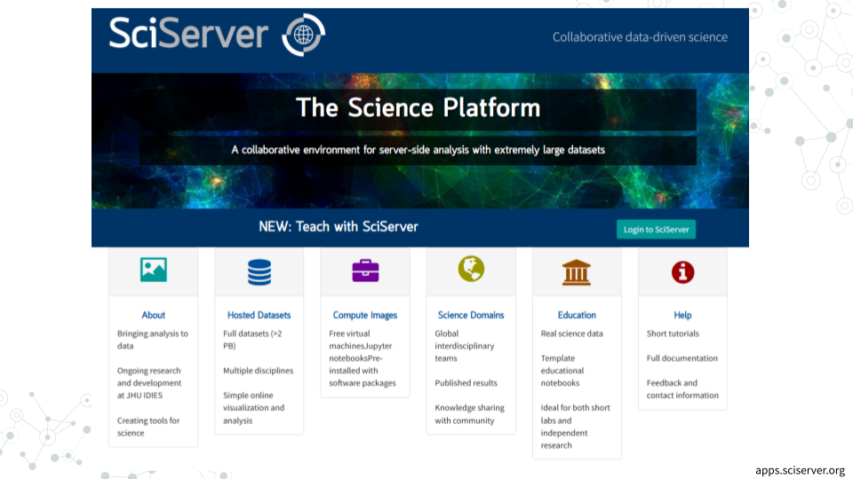

# SciServer

<!-- Set up code of OTTR Book-->

## About SciServer

SciServer is an online platform for doing scientific data analysis. It is used by scientists studying astronomy, biology, oceanography, and more, and is free as long as you are using it for scientific research. Using SciServer means you do not need a fancy computer or need to install any special programs on your computer, you can just log in with your internet browser to start doing research.  For this course, we have set up SciServer with customized collections of programs for RNA-seq analysis, as well as the data that we’ll be analyzing.  Once you sign up for SciServer and are added to the group for this course, you will be able to access these tools and begin your data analysis journey!

