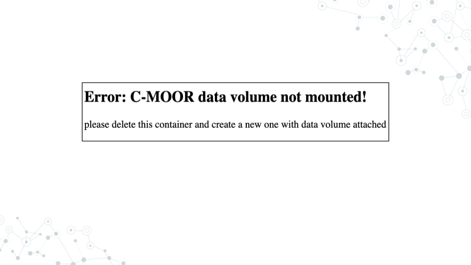

## Running modules on SciServer

#### Purpose

The purpose of this assignment is to learn how to access the modules for your course on SciServer and properly close out your session when finished.

#### Learning Objectives

1. Start up a C-MOOR LearnR compute container
1. Access a C-MOOR module
1. Delete your C-MOOR LearnR compute container when finished

Before beginning this assignment, you should have already created a SciServer account and submitted your SciServer username to your instructor.  In this assignment you will learn how to set up a “compute container” on SciServer.  Compute containers are how you use programs on SciServer.  There are two C-MOOR compute containers on SciServer: “C-MOOR LearnR” has tutorials that will teach you how to run data analyses, and “C-MOOR R-Studio” is where you can work on your own data analysis projects.  This assignment shows you how to set up the C-MOOR LearnR compute container and start up your first tutorial.

### Start up a “C-MOOR LearnR” compute container

This video ([video](https://link.c-moor.org/video-sciserver-create-learnr-container))([slides](https://docs.google.com/presentation/d/1Oaq8RzhaDANxkNh-tTKwme7e095pGgoiq5iZHbt7PLg)) shows you how to create and start up a C-MOOR LearnR compute container.  You can follow along with the video, or follow the steps below.

1. Open [sciserver.org](https://www.sciserver.org/) in a web browser and log in to your account.
    a. If you are already logged in, click “Home” in the top menu to return to the home page.
1. Scroll down to the second set of boxes and click “Compute”
1. Click “Create container”
    a. Give your container a name.  This can be anything you like, but it’s useful if it says something about the purpose of the container so you can tell your containers apart.  You could name this container “Tutorials”, since you’ll be using it to access tutorials.
    a. In the “**Compute Image**” drop-down menu, select the <mark>**C-MOOR LearnR that your instructor chooses**</mark>
    a. Under “**Data Volumes**”, check the box next to “**C-MOOR Data**”
    a. Click “Create”.  This may take a moment.
1. You should now see a new entry in your list of containers
    a. “Created At” should be a few moments ago.
    a. “Name” should be the name you chose
    a. “Image” should be “C-MOOR LearnR”
1. Start your C-MOOR LearnR container by clicking on its name (whatever name you chose when you created it).  This will open in a new tab.
    a. You should see a list of tutorials, organized by topic.

a. If instead you see an error message, you most likely forgot to check the box next to “C-MOOR Data” when you created the container.
  

a. If you see something else, you may have picked the wrong “Compute Image” from the drop-down menu.

**If anything goes wrong, you can always delete your container by clicking the red “X” in the last column, and create a new container.**

### Opening C-MOOR modules

1. If you’re not there already, go to the SciServer compute page and start up the C-MOOR LearnR container.
    a. Open [sciserver.org](https://www.sciserver.org/) in a web browser and log in to your account.
    a. If you are already logged in, click “Home” in the top menu to return to the home page.
    a. Scroll down to the second set of boxes and click “Compute”.
    a. Start your C-MOOR LearnR container by clicking on its name.
1. Click on the module chosen by your instructor.  The tutorial will open in a new tab.
1. Complete the tutorial.

### Delete your C-MOOR LearnR compute container

Compute containers are meant to be temporary, and you can only have 3 containers total on SciServer.  So it’s generally a good idea to clean up after yourself and delete your containers when you’re done using them.  Also, if any updates are made to the C-MOOR LearnR container, **you will need to create a new container to get the latest updates.**

**Deleting your container will delete your progress in a tutorial**, so don’t delete the container until you have completed the tutorial and submitted any required items to your instructor.

To delete a container:

1. If you’re not there already, go to the SciServer compute page.
    a. Open [sciserver.org](https://www.sciserver.org/) in a web browser and log in to your account.
    a. If you are already logged in, click “Home” in the top menu to return to the home page.
    a. Scroll down to the second set of boxes and click “Compute”.
1. Find the container you want to delete.
1. Click on the red “X” in the last column.

